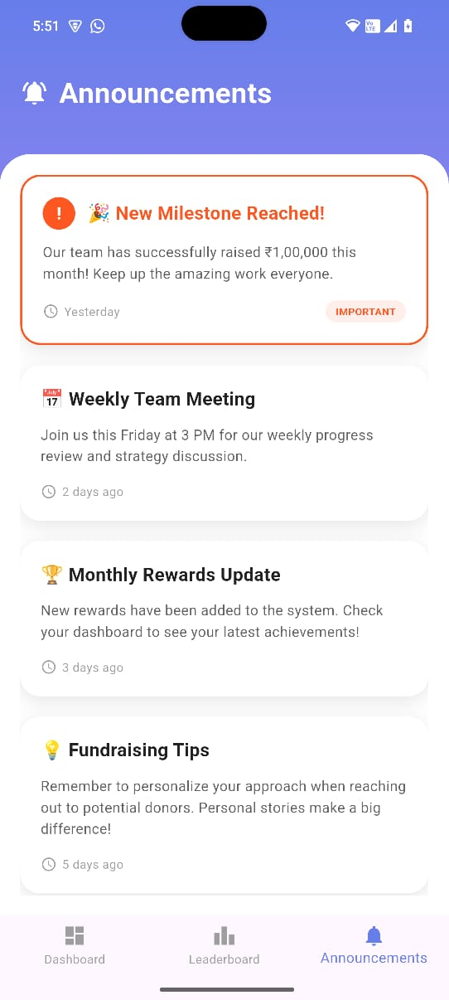

# 📱 FundRaise Intern Dashboard

A beautiful Flutter mobile application for fundraising interns to track progress, view leaderboards, and stay updated with announcements.

## 📱 Screenshots

### 🔐 Login Screen

*Clean authentication interface with toggle between Login/Sign-Up*

### 📊 Dashboard

*Personal stats, referral code, and rewards display*

### 🏆 Leaderboard

*Interactive rankings with 3D podium for top performers*

### 📢 Announcements

*Priority announcements system with timestamps*

## 🎯 Features

- **Login/Sign-Up UI** - Clean authentication interface
- **Dashboard** - Personal stats, referral code, and rewards
- **Leaderboard** - Interactive rankings with podium display
- **Announcements** - Priority announcements system
- **Smooth Animations** - Beautiful transitions throughout

## 🚀 Getting Started

### Prerequisites
- Flutter SDK (3.0+)
- Android Studio
- Android device/emulator

### Installation

#### Download APK
1. Go to [Releases](https://github.com/ArnavDesai1/fundraising-intern-dashboard/releases)
2. Download the latest `fundraising-intern-dashboard-v1.0.apk`

#### Install on Android
1. Enable "Install from Unknown Sources" in Settings
2. Tap the downloaded APK file
3. Follow installation prompts
4. Open the app and enjoy!

#### System Requirements
- Android 5.0 (API level 21) or higher
- 50MB free storage space

#### For Development
git clone https://github.com/ArnavDesai1/fundraising-intern-dashboard.git
cd fundraising-intern-dashboard
flutter pub get
flutter run

## 📦 Dependencies
- google_fonts: ^6.1.0
- flutter_bloc: ^8.1.3
- equatable: ^2.0.5

## 📱 App Flow
1. **Login/Sign-Up** - Toggle authentication UI with animations
2. **Dashboard** - View personal stats, referral code, and earned rewards
3. **Leaderboard** - Check rankings with interactive 3D podium display
4. **Announcements** - Stay updated with important news and updates

## 🛠️ Technology Stack
- Flutter 3.0+
- Material Design 3
- Google Fonts (Poppins)
- Mock data for demo
- Custom animations and transitions

## 🎨 Design Features
- **Gradient Backgrounds** - Beautiful color schemes throughout
- **Smooth Animations** - Fade-in, slide-in, and scale animations
- **Interactive Podium** - 3D-style podium for top performers
- **Responsive Design** - Works perfectly on different screen sizes
- **Custom Typography** - Google Fonts (Poppins) for enhanced readability

## 👨‍💻 Developer
**Arnav Desai**
- GitHub: [@ArnavDesai1](https://github.com/ArnavDesai1)

---
Made with ❤️ and Flutter
